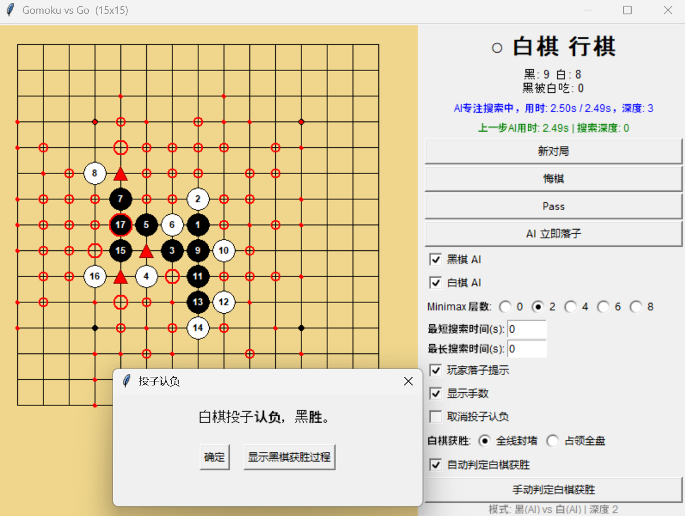
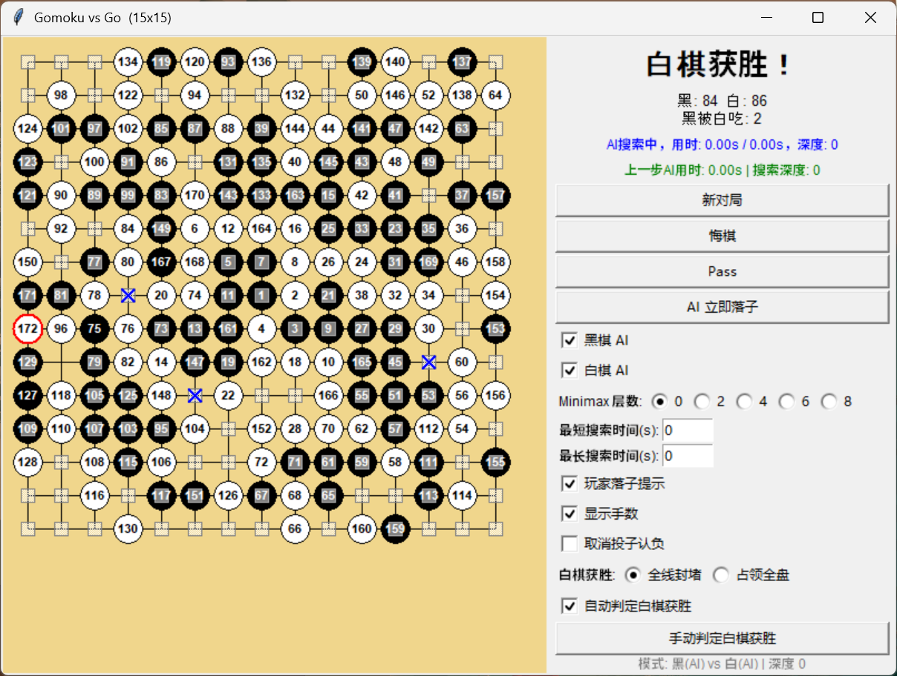

# Gomoku vs Go (windowed AI-vs-AI)

仓库包含两个版本：

| 版本 | 位置 | 说明 |
|------|------|------|
| **正式版**（Official） | 仓库根目录 | 当前完整实现（原 gomoku-vs-go2），AI 棋力更强 |
| **快速版**（Fast） | `v1-fast/` | 旧版实现（原 gomoku-vs-go1），AI 更快但棋力较弱 |

## AI 算法说明

[AI_ALGORITHM.md](AI_ALGORITHM.md) —— 黑棋 / 白棋 AI 算法详解（实心圆 / 三角形 / 大小圆圈等威胁评分体系）。

## 界面预览





## Run

```powershell
python main.py              # 正式版（GUI）
python v1-fast\main.py      # 快速版（GUI）
```

Command-line self-play（正式版）:

```powershell
python main.py --cli
python main.py --size 19
```

Dependencies: Python 3.9+ with `numpy` and `tkinter`.

## Files（正式版）

| File | Purpose |
|------|---------|
| `board.py` | board state, Go capture, white-territory/dead cells, red threat classification, exact candidate ranges, scoring |
| `rules.py` | Renju fouls (overline / four-four / three-three) and line-pattern threat classification |
| `ai_search.py` | White forced-defence recursion, Black Algorithm A, minimax/alpha-beta, farthest-open fallback |
| `ai_black.py` / `ai_white.py` | thin public wrappers |
| `gui.py` | windowed AI-vs-AI application, pass, resign + black-win replay dialog |
| `main.py` | GUI / CLI entry point |

## Board injection helper

Tests can inject a pattern and use AI functions without a GUI:

```python
from board import HybridBoard, WHITE, BLACK
import ai_black, ai_white, ai_search

b = HybridBoard(15)
b.load_centered([
    "0002B00",
    "0021200",
    "0211120",
    "2111120",
    "C222A00",
])
# White to move: b.load_centered leaves history empty and no turn state,
# so call the AI for the desired side directly:
move = ai_white.best_white_move(b, time_limit=10, max_depth=2)
```

`white_should_pass(b)` distinguishes pass from resignation when
`best_white_move` returns `None`.

## Exact marker scoring（正式版）

| Marker | Threat | Score |
|--------|--------|-------|
| solid circle | five point | handled before scoring |
| triangle | four-three / open four | 625 |
| hollow triangle | fragile four-three / open four | 250 |
| large circle | rush four / open three | 125 |
| small circle | sleep three / open two | 25 |
| red dot | sleep two | 1 |
| territory | empty dead cell or dead black cell | -1 |

Black group score is `A * (1 - 0.5 ** n)` where `n` is the group's liberty
count and `A` is the red-position score lost if the group vanished.
