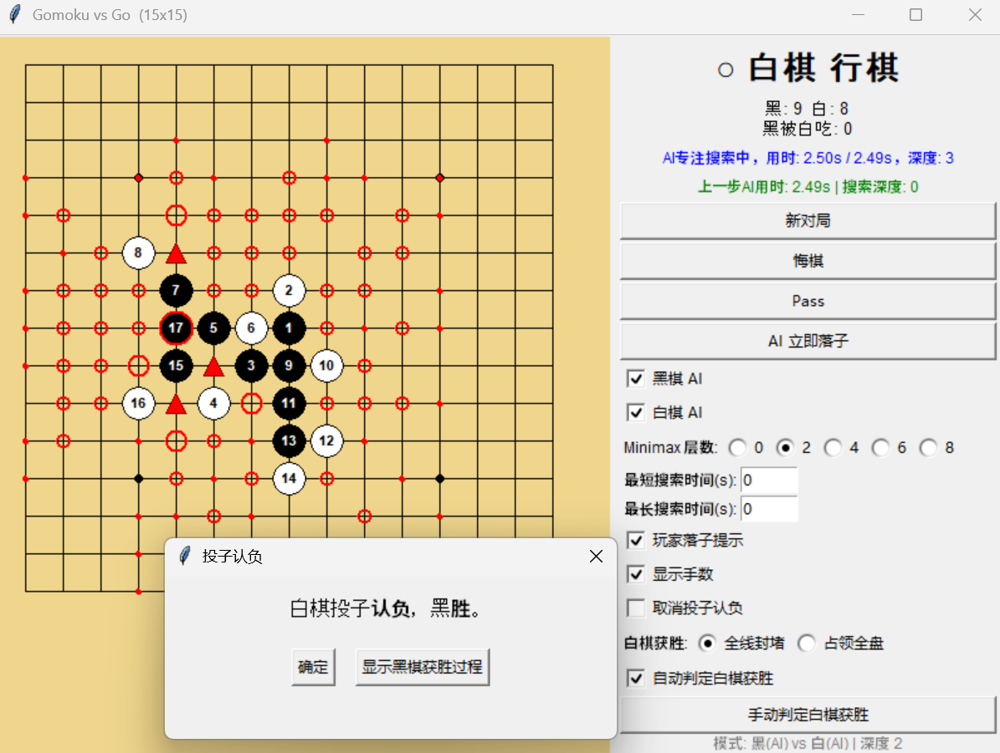
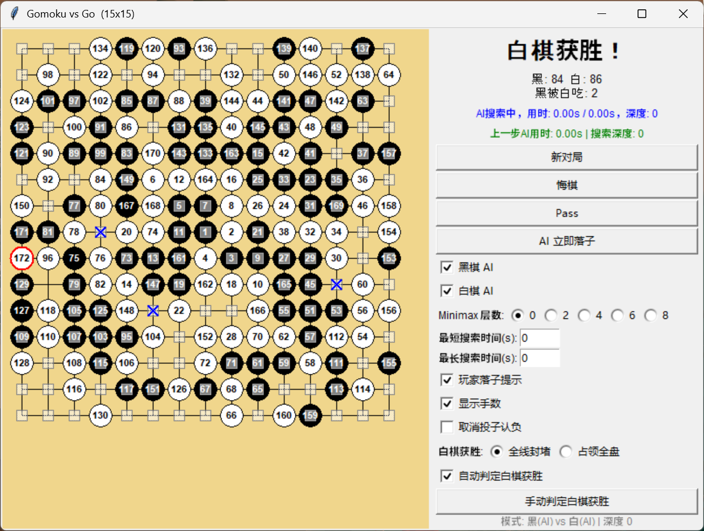

# Gomoku vs Go (windowed AI-vs-AI)

仓库包含两个版本：

| 版本 | 位置 | 说明 |
|------|------|------|
| **正式版**（Official） | 仓库根目录 | 当前完整实现（原 gomoku-vs-go2），AI 棋力更强 |
| **快速版**（Fast） | `v1-fast/` | 旧版实现（原 gomoku-vs-go1），AI 更快但棋力较弱 |

## AI 算法说明

[AI_ALGORITHM.md](AI_ALGORITHM.md) —— 黑棋 / 白棋 AI 算法详解（实心圆 / 三角形 / 大小圆圈等威胁评分体系）。

## 道棋AI（环面·KataGo）

环面模式下勾选主面板的 **「道棋AI（环面·KataGo）」**，白棋（围棋方）改由
道棋俱乐部训练的环面围棋神经网络驱动（[daoqiclub/katrain_daoqi](https://github.com/daoqiclub/katrain_daoqi)
的 DAOQI 模型 + KataGo v1.18.1 官方引擎，文件在 `daoqi_katago/`，下载来源见
其中的 README）：

- **胜率 / 目差**：侧栏紫色一行实时显示 KataGo 的围棋评估（白方视角），每手
  棋后自动刷新；黑方视角数值即"白胜率的补、目差取反"。
- **走子策略**：黑棋连五点位立即挡五、紧迫威胁（成五/四三/活四/冲四/活三）
  由内置白棋算法防守（KataGo 不懂连五），其余安静局面按 KataGo 的围棋评估
  落子。黑棋 AI 始终是内置五子棋引擎。
- **候选点**：「显示AI候选点」在道棋AI模式下显示 KataGo 的 top 候选与白方
  胜率百分比。
- **参数**：「AI 设置」窗口可改贴目（默认 5.5，道棋 16 路惯例，只影响评估）
  与每手访问数（默认 192）。
- **性能**：OpenCL（核显）优先，自动回退 CPU 版；首次启动有一次性的 GPU
  调优（约 4 分钟，之后启动约 25 秒，勾选后后台预热）。引擎文件较大，git
  忽略，换机器时按 `daoqi_katago/README.md` 重新下载。
- 冒烟测试：`python _daoqi_smoke.py`（无 GUI，含跨边提子）、
  `python _daoqi_gui_smoke.py`（真 GUI 对局）。

## 界面预览





## Run

```powershell
python main.py              # 正式版（GUI）
python v1-fast\main.py      # 快速版（GUI）
```

Command-line self-play（正式版）:

```powershell
python main.py --cli
python main.py --size 19
```

Dependencies: Python 3.9+ with `numpy` and `tkinter`.

## Files（正式版）

| File | Purpose |
|------|---------|
| `board.py` | board state, Go capture, white-territory/dead cells, red threat classification, exact candidate ranges, scoring |
| `rules.py` | Renju fouls (overline / four-four / three-three) and line-pattern threat classification |
| `ai_search.py` | White forced-defence recursion, Black Algorithm A, minimax/alpha-beta, farthest-open fallback |
| `ai_black.py` / `ai_white.py` | thin public wrappers |
| `gui.py` | windowed AI-vs-AI application, pass, resign + black-win replay dialog |
| `main.py` | GUI / CLI entry point |

## Move-code export / import

Press **G** (or 导出棋盘(复制)) to copy the full board text, write
`导出/board_dump.txt` and append one coordinate-only line to the
coordinate file (default `导出/粘贴板.md`; folder and file name are
editable in the 选择模式 window).  Press **I** (or 导入坐标) to paste codes or load
a file and replay it: illegal moves (forbidden / self-capture / occupied) are
**never played** - they are listed for confirmation and skipped (the import is
cancelled if you answer No).

- code: letter = column (a..), number = row counted from the bottom (1..size)
  so the centre of 15x15 is `h8`; a pass is `p0`
- dump rows: `1` = black, `2` = white / obstacle / no-liberty
  point, `0` = empty; obstacles are also listed in the header

```bat
python board_tools.py board_dump.txt                 :: analyse a position
python board_tools.py board_dump.txt --ai black --depth 2
python board_tools.py --code "h8 h7 g7 p0" --size 15
python board_tools.py --code-file 粘贴板.md          :: last line of the file
```

## External plugin: Rapfi / Yixin → 粘贴板.md

Lives **outside** the program directory (`../tools/rapfi-plugin/`) so it can never
interfere with a running game, and it is the only grab/check tool kept in the
repository.  Run `tools\rapfi-plugin\rapfi_plugin.bat` or
`py -3.14 tools\rapfi-plugin\rapfi_plugin.py`.
Press **抓 Rapfi 窗口（Ctrl+C）** (or copy the position in Rapfi/Yixin yourself
and press **读取剪贴板**): the plugin grabs the position code from the window
(or the clipboard, spaces optional - `h8i9j10` works), shows the result right
away and appends two lines to `导出/粘贴板.md`:

```text
h8 p0 i7 p0 g7 p0 g8
forbid:g9
```

(`forbid:None` when there is no forbidden point; a blank line separates
positions.)  Yixin's Ctrl+C copies only the position code, so the forbidden
points always come from the **Rapfi engine** itself (`INFO rule 2` +
`YXBOARD` + `YXSHOWFORBID`, 0-based `x,y` coordinates, a pass is added when
needed so it is Black to move) - exactly the list the Rapfi/Yixin window
draws; the board preview marks them as `X`.  When no engine binary is found the
plugin falls back to this project's own `rules.py` (the same Rapfi algorithm)
and says so in the 判定来源 line instead of silently dropping points.  The
plugin only uses this project's own modules as a library (it finds the program
directory by itself) and never edits gui.py and never reads or writes anything
inside the Yixin / Rapfi folder - only the system clipboard.

Reading such a file back:

```python
import board_tools as bt
bt.codes_from_text(text)      # last coordinate line (forbid: lines skipped)
bt.forbidden_from_text(text)  # last forbid: value
bt.blocks_from_text(text)     # [(codes_line, forbid_value), ...]
bt.split_codes("h8i9j10")     # ['h8', 'i9', 'j10']
```

## Board injection helper

Tests can inject a pattern and use AI functions without a GUI:

```python
from board import HybridBoard, WHITE, BLACK
import ai_black, ai_white, ai_search

b = HybridBoard(15)
b.load_centered([
    "0002B00",
    "0021200",
    "0211120",
    "2111120",
    "C222A00",
])
# White to move: b.load_centered leaves history empty and no turn state,
# so call the AI for the desired side directly:
move = ai_white.best_white_move(b, time_limit=10, max_depth=2)
```

`white_should_pass(b)` distinguishes pass from resignation when
`best_white_move` returns `None`.

## Exact marker scoring（正式版）

| Marker | Threat | Score |
|--------|--------|-------|
| solid circle | five point | handled before scoring |
| triangle | four-three / open four | 10000 |
| hollow triangle | fragile four-three / open four | 500 |
| large circle | rush four / open three | 625 |
| small circle | sleep three / open two | 25 |
| red dot | sleep two | 1 |
| territory | empty dead cell or dead black cell | -1 |

Black group score is `A * (1 - (1 / sqrt(2)) ** n)` where `n` is the
group's liberty count and `A` is the red-position score lost if the group
vanished.
